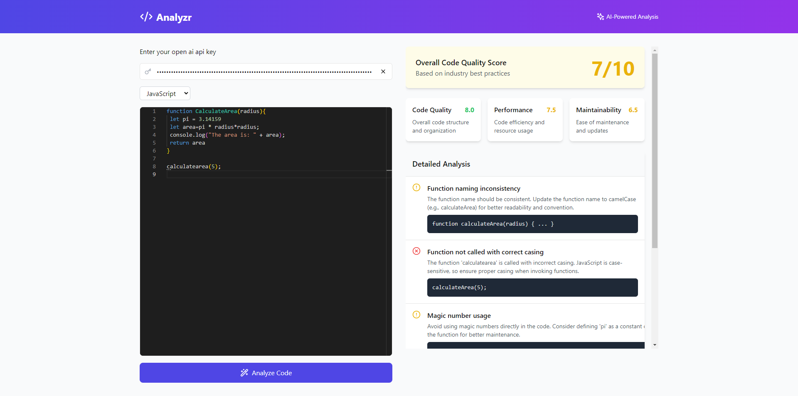

<div align="center">

# ⚡ Analyzr


🔍 *Your AI-powered code companion for accurate, insightful code analysis.*

[Visit Analyzr](https://yourwebsite.com) | [Report Bug](https://github.com/Michonvv/Analyzr/issues) · [Request Feature](https://github.com/Michonvv/Analyzr)


</div>

---

## ✨ Features

- 🤖 **AI-Powered Analysis** - Receive intelligent, language-specific insights powered by GPT models
- 🎯 **Multi-Language Support** - Works with JavaScript, TypeScript, Python, Java, and more
- 🔒 **Secure** - Your API key is stored locally in your browser
- 📊 **Quality Scores** - Get an instant overview of your code’s health
- 💡 **Smart Suggestions** - Actionable improvement tips for better code quality
- ⏲️ **Quick Feedback** - Efficient analysis without real-time dependency

## 🚀 Local Installation

```bash
# Clone the repository
git clone https://github.com/yourusername/analyzr.git

# Navigate to the project
cd analyzr

# Install dependencies
npm install

# Start the development server
npm run dev
```

## 🎮 Usage

1. Open Analyzr in your browser
2. Enter your OpenAI API key
3. Select your programming language
4. Paste your code
5. Hit "Analyze" to get detailed insights!

## 🛠️ Built With

- React
- TypeScript
- OpenAI API
- Monaco Editor
- Tailwind CSS
- shadcn/ui

## 🤝 Contributing

Contributions make the open-source community amazing! We welcome any contributions you make.

1. Fork the Project
2. Create your Feature Branch (`git checkout -b feature/AmazingFeature`)
3. Commit your Changes (`git commit -m 'Add some AmazingFeature'`)
4. Push to the Branch (`git push origin feature/AmazingFeature`)
5. Open a Pull Request

## 📄 License

Distributed under the MIT License. See `LICENSE` for more information.

---

<div align="center">

Made with ❤️ by Michon

</div>